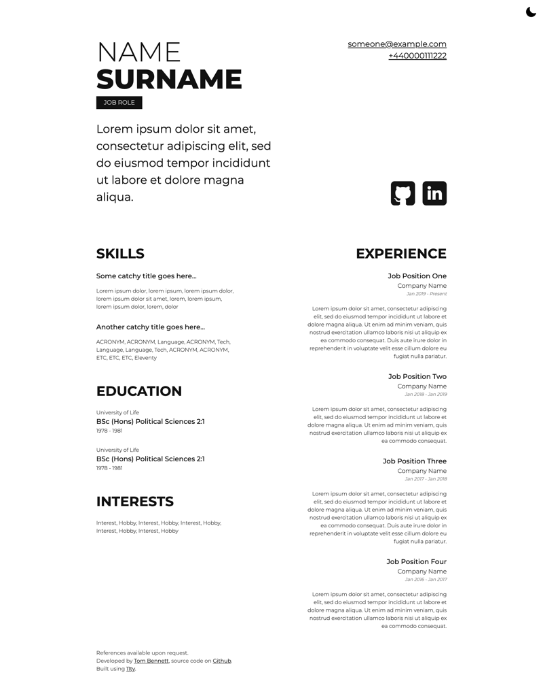

# Eleventy CV Template
This is a little CV site using the 11ty static site generator. 
Feel free to use and add your own information.

## Setup
1. `nvm use`
2. `npm install`
3. `npm run serve`

## How to use
That will get you up and running with Eleventy's built in web server. Then just visit http://localhost:8080 and make any changes you want and it will refresh the server.

### Styles
To update the styles, change the files in the `src/scss` folder and the watcher will recompile the CSS files into `src/_includes/css` which will then be passed through by Eleventy to the `build` folder.

### Content
To update the content, just update the `.toml` files in the `src/_data` folder.

### Template
To update the template, simply change the files in `src/_includes/layout/base.njk` and `src/index/njk` respectively.

### Netlify
If you want to chuck it up on Netlify, you'll want to use the build script `npm run build` rather than the default suggested build command for Eleventy.

## Example
You can view an example [here](https://cv.tombennett.me.uk) where I've used it on my own site. Below is a screenshot of what it could look like.

## Credits
* Social media icons by [edent](https://github.com/edent/SuperTinyIcons)
* Dark/Light mode icons by [akceo](https://github.com/akveo/eva-icons)